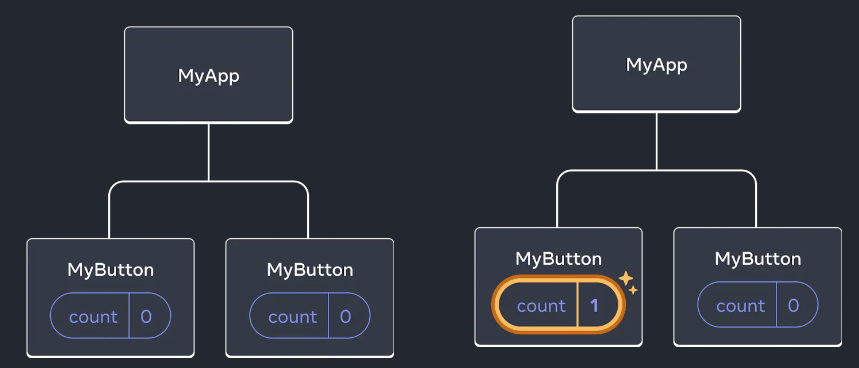
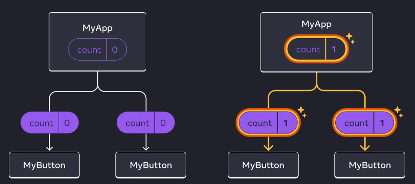

# 1주차 정리

## 컴포넌트 생성 및 중첩하기

- React 앱은 **컴포넌트(Component)** 구성
> **컴포넌트(Component)**<br/>
> - 고유한 로직과 모양을 가진 UI(사용자 인터페이스)의 일부
> - 마크업을 반환하는 자바스크립트 함수(마크업 : Tag로 둘러싸인 코드)
> - 컴포넌트의 이름은 항상 **대문자**로 시작하고, HTML 태그는 소문자로 시작
> - `export default` 키워드는 파일의 기본 컴포넌트를 지정

```javascript
function MyButton() {
  return (
      // 마크업을 반환
    <button>I'm a button</button>
  );
}

// MyButton을 선언했기 때문에 다른 컴포넌트에서 중첩 가능
export default function MyApp() {
    return (
        <div>
            <h1>Welcome to my app</h1>
            <MyButton />
        </div>
    );
}
```
<details>
<summary>export / import / export default</summary>

### export(내보내기)
- 변수나 함수, 클래스 선언할 때 앞에 `export`를 붙이면 내보내기 가능
- 클래스나 함수를 내보낼 땐 세미콜론(;)를 붙이지 않음❗
```javascript
// 배열 내보내기
export let months = ['Jan', 'Feb', 'Mar','Apr', 'Aug', 'Sep', 'Oct', 'Nov', 'Dec'];

// 상수 내보내기
export const MODULES_BECAME_STANDARD_YEAR = 2015;

// 클래스 내보내기
export class User {
  constructor(name) {
    this.name = name;
  }
}

// 선언한 곳과 떨어진 곳에서도 내보내기 가능
function sayHi(user) {
    alert(`Hello, ${user}!`);
}

function sayBye(user) {
    alert(`Bye, ${user}!`);
}

export {sayHi, sayBye}; // 함수 선언부 아래, 위 상관없이 동일하게 작동
```
- `as`를 사용해 원하는 이름으로 내보내기 가능
```javascript
// 📁 say.js
...
export {sayHi as hi, sayBye as bye};


// 📁 main.js
import * as say from './say.js';

say.hi('John'); // Hello, John!
say.bye('John'); // Bye, John!

```
- 모듈 다시 내보내기 가능
```javascript
export {sayHi} from './say.js'; // sayHi를 다시 내보내기 함

export {default as User} from './user.js'; // default export를 다시 내보내기 함
```
---
### import(가져오기)
- 무언가를 가져오고 싶은 경우 `import {...}`안에 작성
```javascript
import {sayHi, sayBye} from './say.js';

sayHi('John'); // Hello, John!
sayBye('John'); // Bye, John!
```
- 가져올 것이 많으면 `import * as <object>`처럼 객체 형태로 가져올 수 있음
```javascript
import * as say from './say.js';

say.sayHi('John');
say.sayBye('John');
```
---
### export default
- 해당 모듈에는 하나의 개체만 있다'라는 것을 명시
- `export default`는 어떤 개체를 가지고 올지 정확히 알 수 있기 때문에 **이름이 없어도 상관없음**
```javascript
// 📁 user.js
export default class User { // export 옆에 'default'를 추가해보았습니다.
  constructor(name) {
    this.name = name;
  }
}

// 📁 main.js
import User from './user.js'; // {User}가 아닌 User로 클래스를 가져왔습니다.(중괄호 필요없음)

new User('John');
```
</details>

---
## JSX로 마크업 작성하기
- JSX(Javascript Syntax eXtension)은 React에서 개발을 위한 javascript를 확장한 문법
- 브라우저를 실행하기 전에 바벨 등을 사용해 JSX를 자바스크립트 형태의 코드로 변환
- `선언형 화면 기술` : 개발자가 JSX를 사용하여 UI를 선언하면, 리액트 엔진이 이를 해석하여 실제 DOM을 효율적으로 관리
### 특징
1. 반드시 부모 요소 하나가 감싸는 형태
    ```javascript
    function App() {
        return (
        // 1. <>
        // 2. <div>
        // 3. <Fragment> // div 태그보다 무거운 편
          <div>Hello</div>
        // </Fragment>
        // </div>
        // </>
        );
    }
    ```
2. 자바스크립트 표현식 사용 가능
- JSX 내부에서 코드를 {} 중괄호로 감싸줌
   ```javascript
   function App() {
    const name = 'SungWook Cha';
     return (
         <div>
             <div>Hello</div>
             <div>{name}!</div>
          </div>
     );
   }
   ```
3. 삼항 연산자(조건부 연산자) 사용
   - AND 연산자 사용
   ```javascript
   function App() {
    const loginYn = 'Y';
    return (
        <>
            <div>
                {loginYn === 'Y' && <div>SungWook Cha 입니다.</div>}
            </div>
        </>
    );
   }
   ```
   - 즉시 실행함수 사용
   ```javascript
   function App() {
   const loginYn = 'Y';
	    return (
        <>
		        {
            (() => {
                if(loginYn === "Y"){
                    return (<div>SungWook Cha 입니다.</div>);
                 } else {
				         return (<div>비회원 입니다.</div>);
                 }
             })
            }
        </>
    );
   }
   ```
4. React DOM은 HTML 속성 이름 대신 camelCase 프로퍼티 명명 규칙 사용
   1) JSX 스타일링
      - 스타일을 적용할 때에도 객체 형태로 넣음
      - camelCase로 작성함(font-size => fontSize)
   2) class 대신 className 사용
      - HTML과 다르게 CSS 클래스를 사용할 때 class가 아닌 className을 사용
5. JSX 내에서 주석 사용방법
   - {/*...*/}와 같은 형식을 사용
   ```javascript
   function App() {
	return (
		<>
			{/* 주석 사용방법 */}
			<div>Hello</div>
		</>
    );
   }
   ```
6. 리스트 렌더링하기
   - 컴포넌트 리스트를 렌더링하기 위해서 `map()`함수를 사용
   ```javascript
   const products = [
    { title: 'Cabbage', id: 1 },
    { title: 'Garlic', id: 2 },
    { title: 'Apple', id: 3 },
   ];
   
   const listItems = products.map(product =>
     <li key={product.id}>  <!-- key : 고유하게 식별 가능한 것으로 조회 -->
       {product.title}
     </li>
   );
   
   return (
     <ul>{listItems}</ul>
   );
   ```
7. 이벤트에 응답하기
   - 이벤트 핸들러를 통해서 이벤트에 응답
   ```javascript
   function MyButton() {
    function handleClick() {
        alert('You clicked me!');
    }
   
   return (
   // 클릭을 통해서 이벤트 호출
    <button onClick={handleClick}>
        Click me
    </button>
    );
   }
   ```

---
## 화면 업데이트하기
- `useState` React 내장 Hook을 사용해 특정 정보를 기억
```javascript
import { useState } from 'react';

function MyButton() {
   const [count, setCount] = useState(0); // 초기값을 0으로 세팅
   
   function handleClick() {
      setCount(count + 1);  // 클릭 이벤트가 발생하면 카운트를 1개씩 증가시킴
   }

   return (
           <button onClick={handleClick}>
              Clicked {count} times
           </button>
   );
}
```
---
## Hooks 사용하기
- `use`로 시작하는 함수를 Hooks라고 함
- 다른 내장 Hooks 참고 [API 레퍼런스](https://ko.react.dev/reference/react)
- 컴포넌트의 상단에서만 Hooks를 호출할 수 있음
---
## 컴포넌트 간에 데이터 공유하기
- 기존에는 버튼을 클릭하면 클릭한 버튼의 count만 업데이트됨
   <br/><br/>
  - 동일한 count를 표시, 업데이트 하려면, 공통의 부모 컴포넌트가 있어야함
  
     ```javascript
    import { useState } from 'react';
    
    // 공통 부모 컴포넌트로 이동
     export default function MyApp() {
       const [count, setCount] = useState(0);
   
       function handleClick() {
         setCount(count + 1);
       }
   
      return (
         <div>
           <h1>Counters that update together</h1>
           <!-- props로 자식 컴포넌트에 count와 이벤트 핸들러를 전달-->
           <MyButton count={count} onClick={handleClick} />
           <MyButton count={count} onClick={handleClick} />
         </div>
       );
     }
    
    // 부모에게서 받은 count와 이벤트 핸들러를 받아서 설정
    function MyButton({ count, onClick }) {
        return (
           <button onClick={onClick}>
               Clicked {count} times
           </button>
        );
     }
     ```