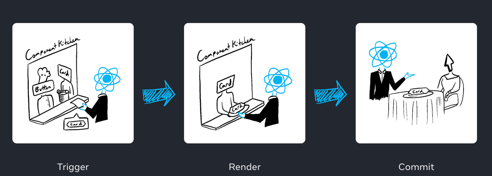
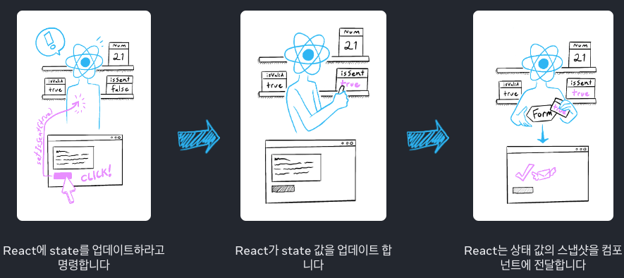

# 상호작용 추가하기

- React에서 시간에 따라 변화하는 데이터를 `state`라고 한다.
- `state`는 어떠한 컴포넌트에든 추가할 수 있으며 필요에 따라 업데이트할 수도 있다.

## 이벤트에 대한 응답

> - React에서는 JSX에서 `이벤트 핸들러`를 사용할 수 있다.
> - `click`, `hover`, `focus`등 사용자와의 상호작용에 따라 작동하는 함수이다.
> - 예를 들면, `<button>`같은 내장 컴포넌트는 `onClick`과 같은 내장 브라우저 이벤트만 지원한다.

### 이벤트 핸들러 추가하기
- JSX 태그에 `prop` 형태로 전달해야 한다.
- 함수를 호출이 아닌 <span style="color:red; font-weight:bold">**전달**</span>이 되어야 한다.
```javascript
export default function Button() {
  function handleClick() {
    alert('You clicked me!');
  }

  return (
      // 태그에 prop으로 이벤트 핸들러 전달 / (onClick={handleClick()} 호출하면 안됨!)
    <button onClick={handleClick}>
      Click me
    </button>
  );
}
```
### 이벤트 핸들러를 Prop으로 전달하기
- 부모 컴포넌트로 자식의 이벤트 핸들러를 지정하는 경우, prop으로 이벤트 핸들러를 전달한다.
```javascript
function Button({ onClick, children }) {
  return (
    <button onClick={onClick}>
      {children}
    </button>
  );
}

function PlayButton({ movieName }) {
  function handlePlayClick() {
    alert(`Playing ${movieName}!`);
  }

  return (
      // onClick 핸들러를 부모 컴포넌트에 전달
    <Button onClick={handlePlayClick}>
      Play "{movieName}"
    </Button>
  );
}
```
### 이벤트 핸들러 명명하기
- 관습적으로 이벤트 핸들러 prop의 이름은 `on`으로 시작해 대문자 영문으로 이어진다.
- 여러 상호작용을 지원한다면 동작에 특화시켜 명명할 수 있다.(`onPlayMovie`, `onUploadImage` 등..)

### 이벤트 전파
- 이벤트 핸들러는 컴포넌트가 가진 어떤 자 컴포넌트의 이벤트를 수신할 수 있다.
- JSX 태그 내에서만 실행되는 `onScroll`을 제외한 React 내의 모든 이벤트는 전파된다.
```javascript
export default function Toolbar() {
  return (
    <div className="Toolbar" onClick={() => {
      alert('You clicked on the toolbar!');
    }}>
      // 버튼을 누르면 'Playing!' 이후에 'You clicked on the toolbar!'이 출력됨
      <button onClick={() => alert('Playing!')}>
        Play Movie
      </button>
      // 버튼을 누르면 'Uploading!' 이후에 'You clicked on the toolbar!'이 출력됨
      <button onClick={() => alert('Uploading!')}>
        Upload Image
      </button>
    </div>
  );
}
```
### 이벤트 전파 멈추기
- `e.stopPropagation()`을 호출해 이벤트 오브젝트 전파를 멈출 수 있다.
```javascript
function Button({ onClick, children }) {
  return (
    <button onClick={e => {
      e.stopPropagation();
      onClick();
    }}>
      {children}
    </button>
  );
}

export default function Toolbar() {
  return (
    <div className="Toolbar" onClick={() => {
      alert('You clicked on the toolbar!');
    }}>
      <Button onClick={() => alert('Playing!')}>
        Play Movie
      </Button>
      <Button onClick={() => alert('Uploading!')}>
        Upload Image
      </Button>
    </div>
  );
}
```
### 기본 동작 방지하기
- 일부 브라우저 이벤트는 그와 관련된 기본 브라우저 동작을 가진다.
```javascript
export default function Signup() {
  return (
    // form의 제출은 페이지 전체를 리로딩함
    <form onSubmit={e => {
      // 페이지 리로딩 방지
      e.preventDefault();
      alert('Submitting!');
    }}>
      <input />
      <button>Send</button>
    </form>
  );
}
```
---
## State : 컴포넌트의 메모리

> - React에서는 `state`를 저장소로 사용한다.
> - `useState` 훅을 사용하면 컴포넌트에 `state`를 추가할 수 있다.
> - `useState`는 초기 `state`를 인자로 받으며, 현재 상태와 상태를 업데이트할 수 있는 함수를 배열에 담아 반환한다.
> ```javascript
> // [변수, 상태 업데이트 함수] = useState(초기값);
> const [index, setIndex] = useState(0);
> const [showMore, setShowMore] = useState(false);
> ```

### 일반 변수로 충분하지 않은 경우
- **지역 변수는 렌더링 간에 유지되지 않는다.**
  - 이 컴포넌트를 두 번째로 렌더링할 때 지역 변수에 대한 변경 사항은 고려하지 않고 처음부터 렌더링한다.
- **지역 변수를 변경해도 렌더링을 일으키지 않는다.**
  - 새로운 데이터로 컴포넌트를 다시 렌더링해야 한다는 것을 인식하지 못한다.

### state 변수 추가하기
```javascript
import { useState } from 'react';

// 지역 변수를 사용하는 대신
// let index = 0;

// [state 변수, setter함수] = useState(초기값)
const [index, setIndex] = useState(0);
```

### useState 해부하기
- `useState`의 유일한 인자는 state 변수의 초기값이다.
- 컴포넌트가 렌더링될 때마다, useState는 다음 두 개의 값을 포함하는 배열을 제공합니다. 
  - 저장한 값을 가진 state 변수 (index). 
  - state 변수를 업데이트하고 React에 컴포넌트를 다시 렌더링하도록 유발하는 state setter 함수 (setIndex).

> #### 작동방식
> 1. 컴포넌트가 처음 렌더링 된다. -> 초기값을 state 변수에 전달
> 2. state를 업데이트한다. -> setter함수를 이용해 데이터 업데이트
> 3. 컴퍼넌트가 두 번째로 렌더링 된다. -> 업데이트된 데이터를 출력

### State는 격리되고 비공개로 유지된다.
- State는 컴포넌트 인스턴스에서 지역적이다.
- 동일한 컴포넌트를 두 번 렌더링한다면 각 복사본은 완전히 격리된 state를 가진다.
### 첫 번째 훅 만나기
- React `useState`와 같이 `use`로 시작하는 다른 모든 함수를 훅이라고 한다.
- 훅은 React가 오직 렌더링 중일 때만 사용할 수 있다.
- 조건문, 반복문 또는 기타 중첩 함수 내부에서는 훅을 호출할 수 없다.
---
## 렌더링과 반영

> - 컴포넌트는 화면에 표시되기 전에 React에 의해 렌더링 되어야 한다.
> > 순서는 아래와 같이 진행된다.
> > 1. 렌더링 유발
> > 2. 컴포넌트 렌더링
> > 3. DOM에 반영
     

### 1단계. 렌더링 유발
컴포넌트 렌더링이 일어나는 데에는 2가지 이유가 있다.
1. 컴포넌트의 **초기 렌더링**인 경우
2. 컴포넌트의 **state가 업데이트**된 경우

> #### 초기 렌더링
> - 앱을 시작할 때 초기 렌더링을 유발해야 한다.
> - `DOM 노드`와 함께 `createRoot`를 호출한 다음 해당 컴포넌트로 `render`메서드를 호출하면 작업이 완료된다.
>
> #### State 업데이트 시 리렌더링
> - 컴포넌트가 처음으로 렌더링 된 후에는 `set 함수`를 통해 상태를 업데이트하여 추가적인 렌더링을 유발할 수 있다.
> - 컴포넌트 상태를 업데이트하면 자동으로 렌더링 대기열에 추가된다.

### 2단계. React 컴포넌트 렌더링
- 초기 렌더링에서 React는 `루트 컴포넌트`를 호출한다.
- 이후 렌더링에서 React는 `state 업데이트가 일어난 컴포넌트`를 호출

### 3단계. React가 DOM에 변경사항을 커밋
- 초기 렌더링의 경우 `appendChild()` DOM API를 사용해 생성한 모든 DOM 노드를 화면에 표시한다.
- 리렌더링의 경우 변경사항이 적용된 DOM을 렌더링 출력과 일치하도록 한다.
- <span style="color:red; font-weight:bold;">렌더링 간에 차이가 있는 경우</span> DOM 노드를 변경한다.
---
## Snapshot으로서의 state

> - 일반적인 JavaScript와 달리, React의 `state`는 snapshot과 유사하게 동작한다.
> - 상태가 변경되면 이미 있는 state 변수 자체를 변경하는 것이 아니라, **`리렌더링`을 유발**한다.

React가 컴포넌트를 다시 렌더링할 떄,
1. React가 함수를 다시 호출
2. 함수가 새로운 JSX 스냅샷을 반환
3. React가 반환한 스냅샷과 일치하도록 화면을 업데이트


---
## state 업데이트를 연속으로 대기열에 추가하기

> - state가 변경된 후 바로 업데이트 되지 않는 이유?
>   - `state`에 변경이 생기면 리렌더링이 유발되지만, <span style="color:red; font-weight:bold">이미 실행 중인 코드에서는 변경이 되지 않는다.</span>
> - `state`를 설정할 때, updater function을 전달하는 방식으로 해결할 수 있다.
---
## state 내 객체, 배열 업데이트
> - `state`는 객체나 모든 종류의 JavaScript 타입을 관리할 수 있다.
> - `state`는 객체나 배열을 업데이트할 때는 **새로운 객체를 생성하거나, 기존 객체의 복사본**을 만들어서 업데이트해야 한다.
> - 일반적으로 객체나 배열을 복사하기 위해 **`...` 스프레드 연산자**를 사용한다.([스프레드 연산자](https://velog.io/@yukyung/Spread-Operator%EB%8A%94-%EC%96%95%EC%9D%80-%EB%B3%B5%EC%82%AC%EC%9D%BC%EA%B9%8C-%EA%B9%8A%EC%9D%80-%EB%B3%B5%EC%82%AC%EC%9D%BC%EA%B9%8C))
> - 객체를 복사하는 작업을 편하게 할 수 있는 `Immer`와 같은 라이브러리를 사용할 수 있다.

