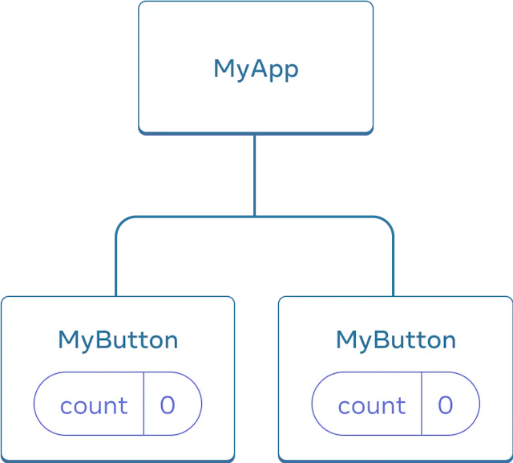

# React로 사고하기

## 컴포넌트를 만들고 중첩하는 방법

React 앱은 컴포넌트로 구성된다.

React 컴포넌트는 마크업을 반환하는 자바스크립트 함수다.

- React 컴포넌트의 이름은 항상 대문자로 시작해야한다.

```jsx
<MyButton />
```

- HTML 태그는 소문자로 시작해야 한다.

```jsx
function MyButton() {
  return <button>I'm a button</button>;
}
```

## 마크업과 스타일을 추가하는 방법

React에서 사용되는 마크업 문법을 JSX라고 한다

- JSX에서는 태그를 닫아야한다.
- 컴포넌트는 여러 개의 JSX 태그를 반환할 수 없다
  - `<div>...</div>` 또는 `<>...</>` 래퍼와 같이 공유되는 부모로 감싸야한다.
  ```jsx
  function AboutPage() {
    return (
      <>
        <h1>About</h1>
        <p>
          Hello there.
          <br />
          How do you do?
        </p>
      </>
    );
  }
  ```

React에서는 class를 지정할때 `className`을 사용한다.
React에서는 스타일을 주고 싶을때 `className`을 통해 CSS클래스를 지정해 사용한다.

```jsx

```

## 데이터를 표시하는 방법

중괄호를 사용하면 코드에서 일부 변수를 삽입하여 사용자에게 보이드록 자바스크립트로 "이스케이프 백"할 수 있다

```jsx
return <h1>{user.name}</h1>;
```

"escape back"이라는 표현은 JSX 컨텍스트에서 일시적으로 빠져나와 자바스크립트 코드를 실행할 수 있게 해주는 기능을 비유적으로 설명한 것이다.

여기서 "escape back"의 의미는 다음과 같다:

1. JSX는 기본적으로 HTML과 유사한 마크업 구문을 사용한다.
2. 그러나 중괄호 {}를 사용하면, 일시적으로 이 마크업 모드에서 "빠져나와" (escape) 순수 자바스크립트 코드를 실행할 수 있다.
3. 즉, JSX 문법에서 잠시 "뒤로 돌아가" (back) 자바스크립트 컨텍스트로 전환한다는 의미다.

따라서 "escape back"은 JSX 내에서 중괄호 {}를 사용하여 자바스크립트 표현식을 삽입하는 행위를 비유적으로 표현한 것이다. 이는 공식 기술 용어가 아니라 개념을 설명하기 위한 표현이다.

## 조건과 리스트를 렌더링하는 방법

### 조건 렌더링

React에서 `if`문을 사용해서 조건부로 JSX를 포함할 수 있고, 조건부 삼항 연산자를 사용하면 더욱 간결한 코드를 작성 할 수 있다.

```jsx
<div>{isLoggedIn ? <AdminPanel /> : <LoginForm />}</div>
```

`else`분기가 필요하지 않으면 더 짧은 `&&` 연산자를 사용할 수도 있다.

```jsx
<div>{isLoggedIn && <AdminPanel />}</div>
```

이러한 접근 방식은 어트리뷰트를 조건부로 지정할때도 동작한다.

### 리스트 렌더링

컴포넌트 리스트를 렌더링하기 위해서는 `for`문 및 `map()`함수와 같은 자바스크립트 기능을 사용한다.

`<li>`에 `key`어트리뷰트가 존재한다.
`key`어트리뷰트는 목록의 각 항목에 대해, 형제 항목 사이에서 해당 항목을 고유하게 식별하는 문자열 또는 숫자다.
React는 나중에 항목을 삽입, 삭제 또는 재정렬할 때 어떤 일이 일어났는지 알기위해 `key`를 사용한다.

```jsx
const listItems = products.map((product) => (
  <li key={product.id}>{product.title}</li>
));

return <ul>{listItems}</ul>;
```

## 이벤트에 응답하고 화면을 업데이트하는 방법

### 이벤트에 응답하기

컴포넌트 내부에 이벤트 핸들러 함수를 선언하여 이벤트에 응답할 수 있다.

```jsx
function MyButton() {
  function handleClick() {
    alert("You clicked me!");
  }

  return <button onClick={handleClick}>Click me</button>;
}
```

### 화면 업데이트하기

컴포넌트가 특정 정보를 기반으로 표시해야 할 때 컴포넌트에 state를 추가한다.

`useState`로부터 현재 state(`count`)와 이를 업데이트할 수 있는 함수(`setCount`)를 얻을 수 있다.
이들은 어떤 이름으로도 지정할 수 있지만 `[somthing,setSomthing]`으로 작성하는것이 일반적이다.

같은 컴포넌트를 여러 번 렌더링하면 각각의 컴포넌트는 고유한 state를 얻게된다.

```jsx
import { useState } from "react";

export default function MyApp() {
  return (
    <div>
      <h1>Counters that update separately</h1>
      <MyButton />
      <MyButton />
    </div>
  );
}

function MyButton() {
  const [count, setCount] = useState(0);

  function handleClick() {
    setCount(count + 1);
  }

  return <button onClick={handleClick}>Clicked {count} times</button>;
}
```

## 컴포넌트 간에 데이터를 공유하는 방법

이전 예시는 각각의 `MyButtons`에 독립적인 `count`가 있고, 각 버튼을 클릭하면 클릭한 버튼의 `count`만 변경되었다.

|                                           |                                              |
| :---------------------------------------: | :------------------------------------------: |
|                     |                      |
| 처음에 MyButton의 count 각 state는 0이다. | 첫 번째 MyButton이 count를 1로 업데이트한다. |

데이터를 공유하고 싶을때는 `state`를 `MyButton`이 아닌 `MyApp`으로 상태를 끌어 올려야한다.

|                                                               |                                                                      |
| :-----------------------------------------------------------: | :------------------------------------------------------------------: |
|                                       |                                              |
| 처음에 MyApp의 count state는 0이며 두 자식에게 모두 전달된다. | 클릭 시 MyApp은 count state를 1로 업데이트하고 두 자식에게 전달한다. |

```jsx
export default function MyApp() {
  const [count, setCount] = useState(0);

  function handleClick() {
    setCount(count + 1);
  }

  return (
    <div>
      <h1>Counters that update separately</h1>
      <MyButton count={count} onClick={handleClick} />
      <MyButton count={count} onClick={handleClick} />
    </div>
  );
}

function MyButton({ count, onClick }) {
  return <button onClick={onClick}>Clicked {count} times</button>;
}
```

# React로 사고하기

## Step 1: UI를 컴포넌트 계층으로 쪼개기

UI를 컴포넌트로 분리하고, 각 컴포넌트가 데이터 모델에 매칭될 수 있도록 한다.

## Step 2: React로 정적인 버전 구현하기

`props`를 이용하여 데이터를 넘겨주는 컴포넌트를 구현한다.

## Step 3: 최소한의 데이터만 이용해서 완벽하게 UI State 표현하기

state(상태)를 지정한다

> 상태를 정하는 방법:

> 1. 시간이 지나도 변하지 않나요? 그러면 확실히 state가 아닙니다.
> 2. 부모로부터 props를 통해 전달됩니까? 그러면 확실히 state가 아닙니다.
> 3. 컴포넌트 안의 다른 state나 props를 가지고 계산 가능한가요? 그렇다면 절대로 state가 아닙니다!

## Step 4: State가 어디에 있어야 할 지 정하기

React는 항상 컴포넌트 계층구조를 따라 부모에서 자식으로 데이터를 전달하는 단방향 데이터 흐름을 사용한다.

어떤 컴포넌트에 state를 둘지 정하는 방법:

> 1. 해당 state를 기반으로 렌더링하는 모든 컴포넌트를 찾으세요.
> 2. 그들의 가장 가까운 공통되는 부모 컴포넌트를 찾으세요. - 계층에서 모두를 포괄하는 상위 컴포넌트
> 3. state가 어디에 위치 돼야 하는지 결정합시다
>    1. 대개, 공통 부모에 state를 그냥 두면 됩니다.
>    2. 혹은, 공통 부모 상위의 컴포넌트에 둬도 됩니다.
>    3. state를 소유할 적절한 컴포넌트를 찾지 못하였다면, state를 소유하는 컴포넌트를 하나 만들어서 상위 계층에 추가하세요.

## Step 5: 역 데이터 흐름 추가하기
